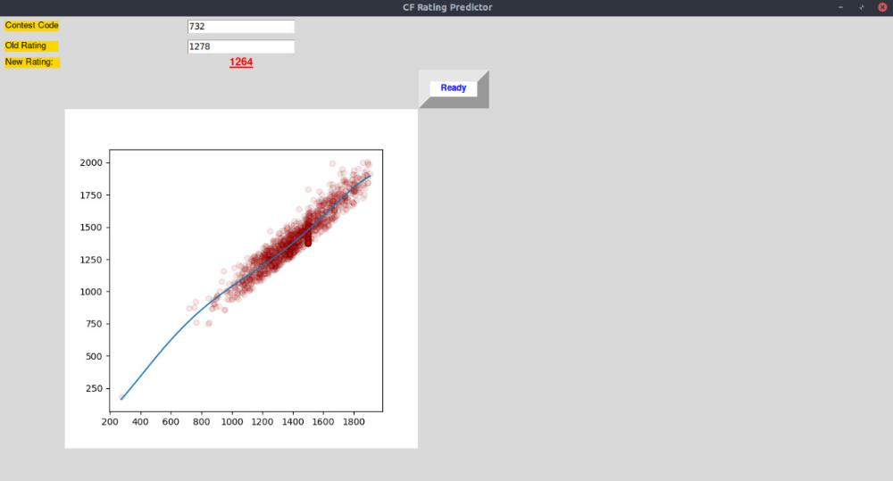

<h1>Codeforces Rating Predictor</h1>

This is a project that uses urllib to fetch data from a given contest code of Codeforces, then sklearn is used to train and test the model on the basis of Old and New ratings. 
<br>
<br>
Then tkinter is used to provide a graphical user interface that will take the input of your current rating and the contest code as per which you want to predict your new rating. The output will be your new rating and a graph that depicts how properly the data is fitted.

<h1>Build Instructions</h1>
Simply clone the repository and run the following command in proper folder:

```python3 CF-Rating_pred.py```

tkinter, matplotlib, urllib, sklearn, numpy, ast, requests need to be installed.
All can be install using:

```pip3 install <library>```

for Windows and:

```apt install python3-pip```

followed by the same command above for Linux.

<h1>Screenshots of the Interface</h1>

